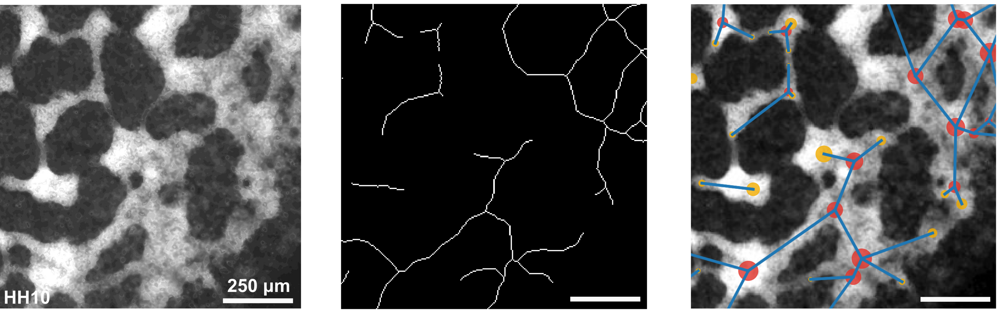
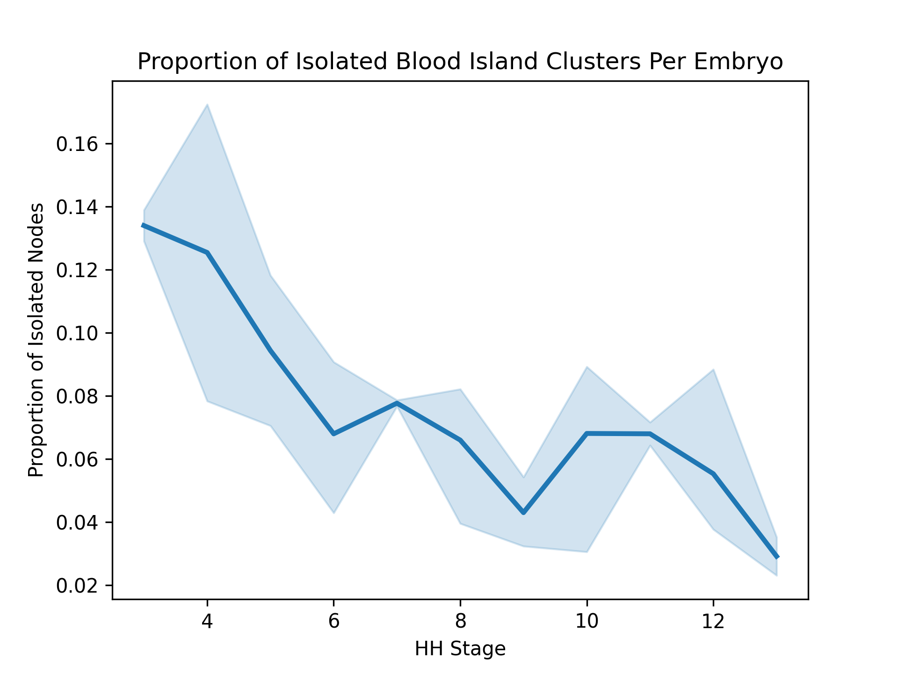
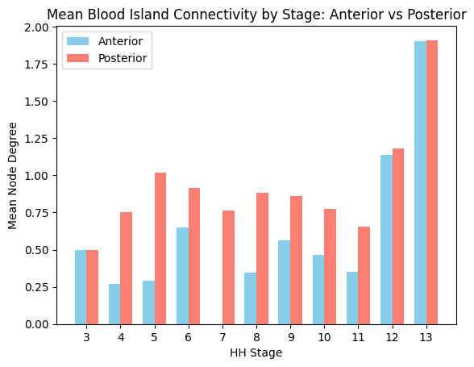

# Vasculogenesis-Network-Skeleton

Custom image processing and network analysis tool designed to quantify network formation and structure of blood islands in chicken embryos.

<p align="center">
  
  <em>Automated pipeline workflow: Raw microscope image (left) → Skeletonisation (center) → Abstracted network model with extracted nodes and edges (right).</em>
</p>


## Features

**1. Adaptive image segmentation:** uses local Bernsen thresholding to generate high quality blood island segmentation with minimal manual input, adapting to variable image contrast.**

**2. Network model setup:** with a custom node-merging algorithm to ensure network structures are biologically significant.

**3. Dataset management:** via an embryo\_ID system allows for unambiguous, high-throughput processing of standard and drug experiment datasets.

**4. Plotting and visualisation code:** including tracking feature changes through development, spatial grid analysis, and area analysis.

**5. Support for live imaging:** via stack processing to track network features for video or time-lapse imaging.**

## Example outputs

<p align="center">
  
  
</p>


## Installation and use

**Environment setup**

```bash

git clone git@github.com:izzy-cole/Vasculogenesis-Network-Skeleton.git
cd Vasculogenesis-Network-Skeleton

pip install -r requirements.txt

```
**Execution pipeline**

Run the image preprocessing script *skeleton.ijm* via Fiji/ImageJ on raw TIFF images

Set up path variables in config.py

Run *run\_skeleton\_model.ipynb* to initialise the network model on your dataset

View analytics via *skeleton\_analysis\_results.ipynb*

See the full guide.md for more detailed information on parameter setup.


